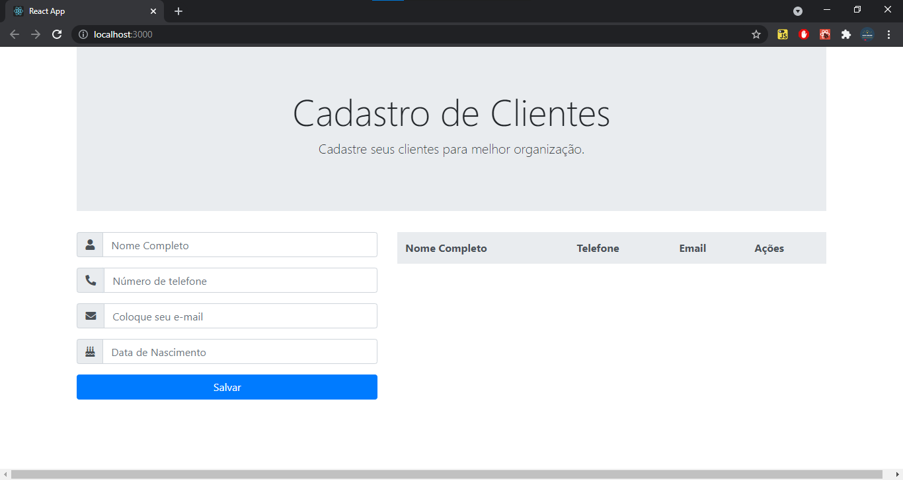
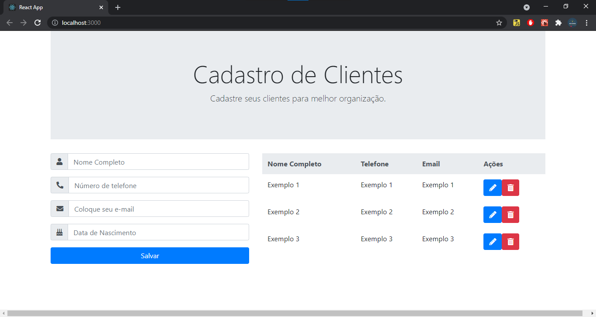
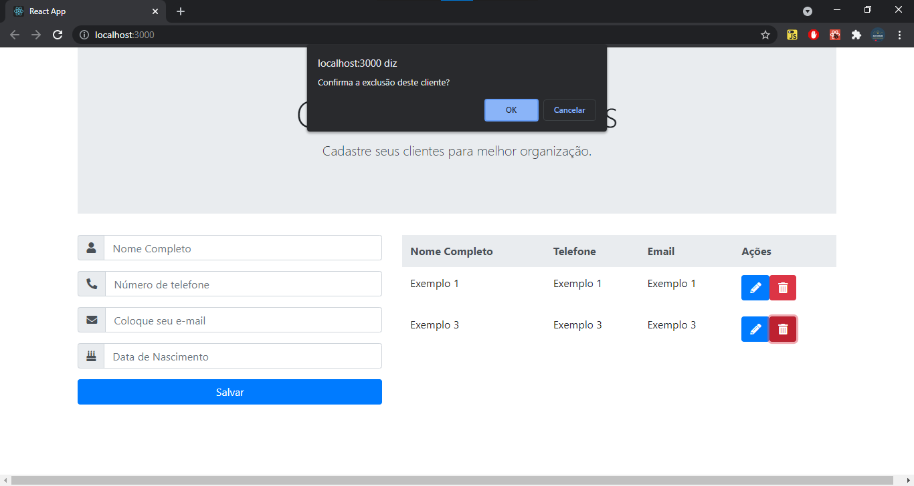

# Crud-React

 

My first crud in react

<h4 align="center"> 
	🚧  Crud-React 🚀 🚧
</h4>

---

## Features

- [x] Register Client with Full Name, phone number, email and Birth Date.
- [x] Render all data from database in firebase
- [x] Edit button works
- [x] Delete button works

---

## App Preview

---

## Developer Quick start

1. [Pre-requisites](#pre-requisites)
1. [Run the project](#run-the-project)

### Pre-requisites

- Setup your [favorite code editor](https://flutter.dev/docs/get-started/editor) (I recommend using [VS Code](https://code.visualstudio.com/))

### Run The Project

In the project directory, you can run:

### `yarn start`

Runs the app in the development mode.
Open http://localhost:3000 to view it in the browser.

The page will reload if you make edits.
You will also see any lint errors in the console.

---

## Technology

- HTML
- CSS
- BootStrap
- JavaScript
- ReactJS
- Firebase

## Author

---

<a href="https://github.com/alex-cerlini">
 
  
 <b>Alexander Andrade Cerlini</b></a> <a href="https://github.com/alex-cerlini" title="Alex Cerlini">🚀</a>

Feito com ♥.

